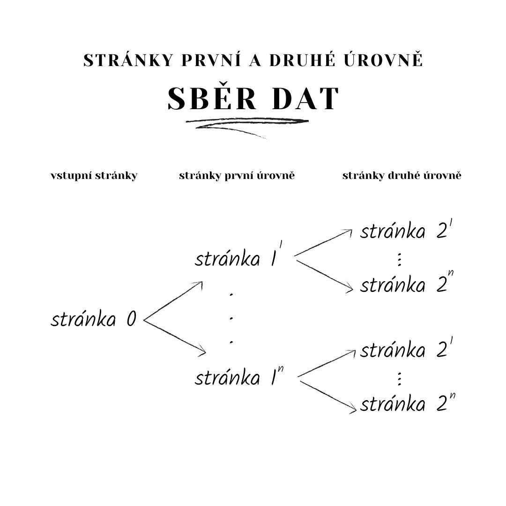

# Analysis of Facebook recommended (related) pages

This repo provides a code for scraping the data (both relations between the pages and posts), 
processing them and simple analysis of the recommended pages by Facebook algorithm.

The repo consists of:
<ul>
    <li><i>data</i></li>
        <ol>
        <li><i>links1</i>: 
        List of unique initial pages (their url link)</li>
        <li><i>links2-uniq</i>: 
        List of unique recommended pages for the initial pages (their url link)</li>
        <li><i>data1.csv</i>: 
        Initial pages and their related (recommended) pages. 
        The first column are initial pages and the rest of the columns are recommended.</li>
        <li><i>data2-uniq.csv</i>: 
        Recommended pages for initial pages and recommended for that recommended pages.
        The first column are recommended for initial pages and the rest of the columns are recommended of recommended.
        For better understaing see the image Sber dat below.</li>
        <li><i>labeled_posts.csv</i>: 
        Posts for relevant pages downloaded using CrowdTangle and labeled by their stance to climate change.</li>
        </ol>
    <li><i>src</i></li>
        <ol>
        <li><i>notebooks</i>: directory with various experiments and calculations</li>
        <li><i>pages_content.py</i>: script for scraping the posts for given pages</li>
        <li><i>related_pages.py</i>: script for scraping the relations (recommendations) between the pages</li>
        </ol>
    <li><i>text</i>: directory with text and figures of diploma thesis</li>
    <li><i>interactive_graph_labeled.html</i>: 
    several versions of interactive plotly graph visualization of pages relations</li>
</ul>

